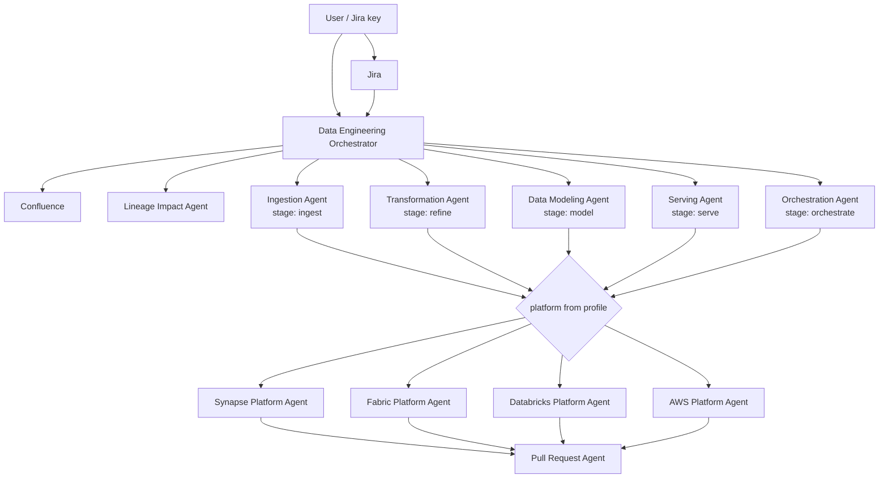

# Gravity Data Engineering Agents Workspace

This workspace standardizes the local setup for Gravity O&S data engineering agents, Jira and Confluence MCP access, and Synapse artifact development workflows.

Its purpose is to help developers open the agents workspace, connect Atlassian tooling, work against the nested Synapse artifacts repository, and follow the correct agent guardrails for documentation, Jira-driven implementation, and Synapse roundtrip editing.

## What This Workspace Contains

- `.github/agents/` generic, platform-agnostic custom agents (see [Agent Architecture](#agent-architecture)):
  - Data Engineering Orchestrator, Jira, Confluence
  - Stage agents: Ingestion, Transformation, Data Modeling, Serving, Orchestration
  - Lineage Impact Agent
  - Platform agents: Synapse, Fabric, Databricks, AWS
  - Pull Request Agent
- `.github/project/` project profiles (`profiles/<id>/project-profile.yaml` + `project-knowledge.md`), the default selector `active-profile.yaml`, and per-platform templates.
- `.github/instructions/` generic engineering standards and per-platform file rules.
- `docs/reference/` shared reference files such as lineage PDFs and source/schema samples.
- `docs/internal/` internal notes that are useful for maintainers but not part of the agent runtime flow.
- `scripts/start-mcp-atlassian.py` for Jira and Confluence MCP startup using `.env`.
- `synapse_roundtrip.py` and supporting tools for Synapse artifact indexing, extraction, editing, and roundtrip conversion.
- `tools/scan_project.py` read-only repository scanner used by `/init-project-profile`.
- `tools/build_lineage.py` table-level lineage from script dependencies -> `.lineage/<profile>/lineage.pdf`, `lineage.json`, `lineage_edges.csv` (run `tooling.build_lineage` from the profile, or the VS Code task `Lineage: build table-level lineage PDF`).
- `synapse_artifacts/` as a nested cloned Synapse artifacts repository.

## Prerequisites

- Windows.
- VS Code with GitHub Copilot Chat and agent mode.
- Git.
- Python 3.10 or newer recommended.
- PowerShell.
- Access to the Azure DevOps repository for Synapse artifacts.
- DevStack Atlassian access and tokens for Jira and Confluence MCP.
- Python dependencies installed from `requirements.txt`.

## Initial Setup

**New developers: follow [SETUP_GUIDE.md](SETUP_GUIDE.md) for the concise one-time setup.** The sections below give more background.

Clone and open this agents workspace.

For team distribution and teammate onboarding, see [docs/team-agent-packaging.md](docs/team-agent-packaging.md).

```powershell
git clone <agents-workspace-repo-url> gravity_o&s_agents
cd gravity_o&s_agents
code .
```

Create and activate the local virtual environment.

```powershell
python -m venv .verify_env
.\.verify_env\Scripts\Activate.ps1
```

Install or upgrade `pip`.

```powershell
python -m pip install --upgrade pip
```

Install Python dependencies from `requirements.txt`.

```powershell
python -m pip install -r requirements.txt
```

`requirements.txt` currently installs `mcp-atlassian` for Jira/Confluence MCP.

Clone the Synapse artifacts repository into the workspace root.

```powershell
git clone https://Volkswagen-AG@dev.azure.com/Volkswagen-AG/IT-RA/_git/synapse_artifacts synapse_artifacts
```

Confirm VS Code MCP configuration points to the local virtual environment Python executable and the startup script:

- `.vscode/mcp.json` should invoke `.verify_env/Scripts/python.exe`.
- The MCP command should run `scripts/start-mcp-atlassian.py`.

## `.env` Setup

Create a local `.env` file in the workspace root. Do not commit this file. You can start from `.env.example` and replace the placeholders locally.

```powershell
@"
JIRA_URL=...
JIRA_TOKEN=...
CONFLUENCE_URL=...
CONFLUENCE_TOKEN=...
"@ | Set-Content .env
```

Use real values only in your local `.env`.

`scripts/start-mcp-atlassian.py` maps:

- `JIRA_TOKEN` to `JIRA_PERSONAL_TOKEN` or `JIRA_API_TOKEN` based on the Jira URL.
- `CONFLUENCE_TOKEN` to `CONFLUENCE_PERSONAL_TOKEN` or `CONFLUENCE_API_TOKEN` based on the Confluence URL.

## Validation

Reload VS Code after setup.

```text
Developer: Reload Window
```

Then validate:

- Check that the Jira and Confluence MCP servers are available in Copilot Chat.
- Ask Copilot or the Jira agent to fetch a Jira ticket read-only.
- Ask Copilot or the Confluence agent to fetch a known Confluence page read-only.
- Confirm the Synapse artifacts folder exists.

```powershell
Test-Path .\synapse_artifacts
```

## Agent Architecture

Agents contain no project names, paths, or layer names. Everything project-specific is read from a project profile in `.github/project/profiles/<id>/`, so the same agents work for Synapse, Fabric, Databricks, AWS, any layer naming, and several projects in one workspace.



- **Orchestrator** plans and routes; never edits.
- **Stage agents** own data engineering logic per logical stage. Each project layer maps to one stage in the profile, e.g. `landing -> ingest`, `bronze -> ingest`, `curated/staging/silver -> refine`, `core/gold -> model`, `reporting/semantic -> serve`.
- **Platform agents** are the only agents that edit files. They know the artifact format, safe edit workflow, dialect rules, and deploy guardrails of one technology.
- **Hybrid projects**: set `platform.secondary` and a per-layer `platform` override (for example ingest on AWS Glue, model on Databricks).

### Onboard Another Project

1. Clone the project's platform repository into the workspace (any folder name, e.g. `Synapse-itf-Dev/`).
2. Run `/init-project-profile` (or just ask the orchestrator about a file in that folder; it starts onboarding automatically). The `Project Setup Agent`:
   - runs `tools/scan_project.py` (structure, git, schemas, pipelines, sources, CI/CD);
   - reads the repo's own README, docs, and nested `.github` Copilot rules (VS Code does not load nested ones);
   - opens a few reference artifacts to learn real conventions;
   - writes `profiles/<id>/project-profile.yaml`, `profiles/<id>/project-knowledge.md`, and `.github/instructions/project-<id>.instructions.md` (`applyTo: "<folder>/**"`) after approval. Every value cites evidence; unknown values stay `<placeholders>`.
3. Answer the listed questions (Jira keys, Confluence space, CONFIRM items).
4. Rescan later with `/refresh-project-profile`. Without the chat terminal tool, use the VS Code tasks `Onboard: list project candidates` and `Onboard: scan project root`.

Profile selection per request: artifact path -> Jira label (`jira_labels`) -> Jira key -> `active-profile.yaml` -> ask. Current profiles: `gravity-os` (Synapse, `synapse_artifacts/`, label `Gravity_Platform`), `finance` (Synapse, `Synapse-itf-Dev/`, label `GIE`).

## Main Use Cases

### Jira-Driven Data Engineering Implementation

Use the Data Engineering Orchestrator flow for Jira tickets. The Jira ticket description must be shown before implementation analysis begins.

Typical flow:

1. Fetch the Jira ticket read-only.
2. Show the ticket description and acceptance criteria.
3. Route to the correct layer agent.
4. Inspect the relevant Synapse artifacts and metadata.
5. Make the narrowest implementation change required.
6. Validate and prepare a PR-ready summary.

### Confluence Read, Search, Summarize, and Update

Use the Confluence agent for documentation work.

Read-only actions include:

- Search pages.
- Fetch known pages.
- Summarize relevant sections.
- Compare versions.
- Inspect comments or attachments when needed.

Confluence writes require explicit human approval for the exact page and exact change before creating, updating, deleting, moving, restricting, labeling, commenting, or attaching content.

### Layer-Specific Routing

The orchestrator maps each project layer from the profile to a stage agent. For Gravity O&S:

- `landing` -> Ingestion Agent
- `curated`, `staging` -> Transformation Agent
- `core` -> Data Modeling Agent
- `reporting` -> Serving Agent
- pipelines/metadata -> Orchestration Agent

### Synapse Artifact Editing

Do not hand-edit Synapse notebook or SQL script JSON.

Use `synapse_roundtrip.py` for:

- Extracting editable content.
- Creating new SQL script drafts.
- Converting reviewed changes back to Synapse JSON.
- Preserving Synapse artifact structure.

For new Synapse SQL script artifacts, use the project roundtrip pattern:

```powershell
python synapse_roundtrip.py new-sqlscript --name <artifact-name> --folder <Synapse-folder-name>
```

Validate and review the editable SQL before converting it back to JSON.

### Metadata-Driven Pipeline Onboarding

Pipelines are metadata-driven. Before changing orchestration behavior, inspect:

- Pipeline parameters.
- Activities.
- Dependencies.
- Configuration metadata.
- Trigger and linked service assumptions.

Change the metadata or artifact layer that owns the behavior rather than patching around it.

### PR Preparation

Use the Pull Request Agent when preparing PR-ready changes. Final implementation changes normally belong under `synapse_artifacts/` unless the task explicitly asks for agent, instruction, tooling, or documentation updates.

## Guardrails

- Confluence writes require explicit human approval for the exact page and exact change.
- Jira ticket descriptions must be shown before implementation analysis.
- Synapse SQL and notebook JSON must use the roundtrip workflow.
- Final implementation changes are normally restricted to `synapse_artifacts/` unless explicitly requested.
- Do not commit `.env`, tokens, `.verify_env`, `.synapse_work`, generated local caches, or other machine-local files.
- Do not hand-edit Synapse notebook or SQL script JSON.
- Prefer exact ticket keys, object names, table names, notebook names, pipeline names, and file names before broader searches.

## Common Commands

Activate the virtual environment.

```powershell
.\.verify_env\Scripts\Activate.ps1
```

Run the Atlassian MCP startup script manually.

```powershell
python .\scripts\start-mcp-atlassian.py
```

Build the Synapse index if the tool exists in this checkout.

```powershell
python .\tools\build_synapse_index.py
```

Show roundtrip help.

```powershell
python .\synapse_roundtrip.py --help
```

Create a new SQL script draft using the project pattern.

```powershell
python .\synapse_roundtrip.py new-sqlscript --name <artifact-name> --folder <Synapse-folder-name>
```

## Troubleshooting

### `mcp-atlassian` Not Found

Verify the virtual environment is active and `mcp-atlassian` is installed.

```powershell
.\.verify_env\Scripts\Activate.ps1
python -m pip show mcp-atlassian
python -m pip install -r requirements.txt
```

### Jira or Confluence Tools Are Unavailable

Reload VS Code and check `.vscode/mcp.json`.

Confirm that:

- The configured Python path points to `.verify_env/Scripts/python.exe`.
- The startup script points to `scripts/start-mcp-atlassian.py`.
- `.env` exists in the workspace root.
- Jira and Confluence URLs and tokens are present.

### Azure DevOps Clone Access Issues

Confirm you have access to the Azure DevOps project and repository.

```powershell
git ls-remote https://Volkswagen-AG@dev.azure.com/Volkswagen-AG/IT-RA/_git/synapse_artifacts
```

If authentication fails, refresh credentials through Git Credential Manager or sign in again using the expected Volkswagen/Azure DevOps account.

### Agent Not Visible

Reload VS Code and Copilot Chat.

```text
Developer: Reload Window
```

Then reopen Copilot Chat and verify agent mode is enabled.

### Token Problems

Check that tokens are current, correctly scoped, and placed only in `.env`.

Do not paste real tokens into chat, documentation, commits, screenshots, or PR descriptions.

## Developer Onboarding Checklist

- [ ] Clone and open the agents workspace.
- [ ] Create `.verify_env`.
- [ ] Activate the virtual environment.
- [ ] Install or upgrade `pip`.
- [ ] Install Python dependencies from `requirements.txt`.
- [ ] Clone `synapse_artifacts/` into the workspace root.
- [ ] Create local `.env` with Jira and Confluence placeholders replaced by real local values.
- [ ] Confirm `.vscode/mcp.json` points to `.verify_env/Scripts/python.exe` and `scripts/start-mcp-atlassian.py`.
- [ ] Reload VS Code.
- [ ] Validate Jira MCP read-only access.
- [ ] Validate Confluence MCP read-only access.
- [ ] Confirm `synapse_artifacts/` exists.
- [ ] Review the guardrails before making Jira, Confluence, or Synapse changes.
